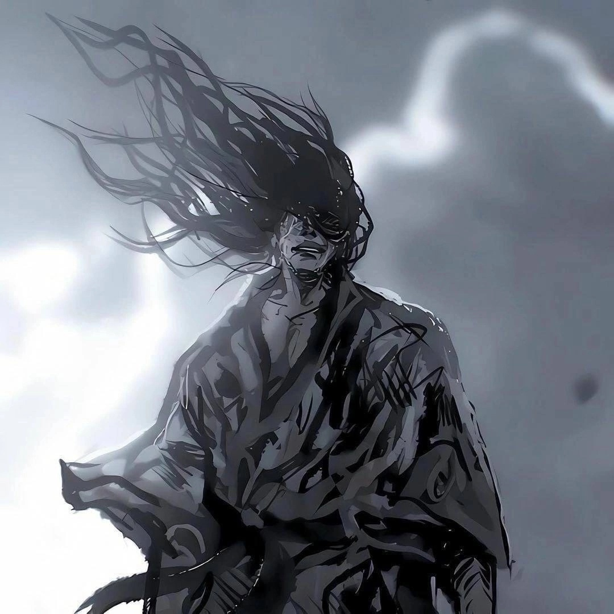

# Мое портфолио

Привет меня зовут Данила. 4 курс института. Хочу найти работу, чтобы получить практические навыки и опыт, стать самостоятельным и независимым, оплачивать своё обучение. У самурая нет цели, есть только путь

## Обо мне
Увлекаюсь аниме, знаю 3 языка (Английский, французкий,японский), люблю спорт, покушать, Мечтаю переехать в Японию.
Кандидат мастера спорта по плаванию

## Мои навыки
-Комуникабельный 
-Любознательный
-Ответственный
-Стрессоустойчивый 